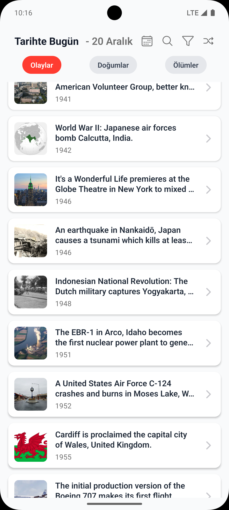

# Magic History

## 1. Proje Tanımı

Magic History, kullanıcılara belirli bir tarihte yaşanmış önemli olayları, doğumları ve ölümleri sunan bir mobil uygulamadır. Uygulama, tarihsel verileri zenginleştirmek ve kullanıcıya sunmak için yapay zeka teknolojilerinden faydalanır.

## 2. Temel Özellikler

Uygulama, kullanıcıların bir takvim arayüzü üzerinden istedikleri tarihe ait olayları, doğumları ve ölümleri keşfetmelerine olanak tanır. Seçilen her bir tarihi olay, Google Gemini AI aracılığıyla zenginleştirilir; bu kapsamda olayın Türkçe çevirisi, detaylı bir anlatımı ve konuyla ilişkili diğer tarihi olaylar kullanıcıya sunulur. Ayrıca, olaylar Wikipedia'dan alınan görsellerle desteklenir ve Gemini AI tabanlı bir arama fonksiyonu ile kullanıcıların spesifik olay, kişi veya konseptleri araştırması sağlanır.

## 3. Teknolojik Yapı

Proje, Expo (React Native) çerçevesi üzerinde TypeScript dili kullanılarak geliştirilmiştir. Uygulama içi navigasyon, Expo Router ile dosya tabanlı bir sistem üzerinden yönetilmektedir. Veri katmanında ise tarihsel olaylar için `history.muffinlabs.com`, görsel içerikler için Wikipedia API ve yapay zeka destekli özellikler (çeviri, içerik üretimi, arama) için Google Gemini API olmak üzere üç temel harici servis entegre edilmiştir.

## 4. Kurulum ve Başlatma

Projeyi yerel ortamda çalıştırmak için aşağıdaki adımlar izlenmelidir.

```bash
# 1. Bağımlılıkları yükleyin
npm install

# 2. Geliştirme sunucusunu başlatın
npx expo start
```

## 5. Uygulama Görselleri

| | | |
| :---: | :---: | :---: |
| <div align="center"><p><b>Ana Ekran</b></p><p>Belirli bir tarihteki olayları, doğumları ve ölümleri listeler.</p></div> | <div align="center"><p><b>Tarih Seçimi</b></p><p>Takvim üzerinden istenilen tarihe ait verileri keşfetme.</p></div> | <div align="center"><p><b>Kategori ve Yıl Filtreleme</b></p><p>Olay, doğum, ölüm kategorileri ve yıla göre filtreleme imkanı.</p></div> |
| <div align="center"><p><b>Arama Ekranı</b></p><p>Yapay zeka destekli metin tabanlı arama özelliği.</p></div> | <div align="center"><p><b>Detay Ekranı</b></p><p>Seçilen olayın çevirisi, detaylı anlatımı ve ilgili olayları sunar.</p></div> | <div align="center"><p><b>İlgili Olay Önerileri</b></p><p>Gemini AI tarafından üretilen, mevcut olayla ilişkili diğer tarihi olaylar.</p></div> |
